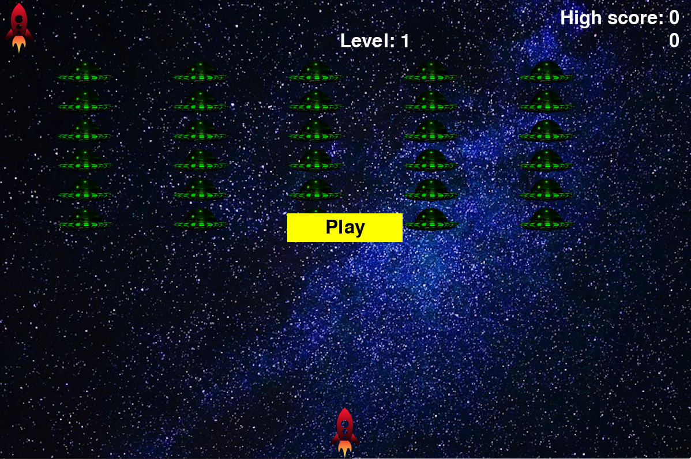

# 2D Game - ***Alien Invasion***

## Description

You control a space ship, which can move left (`<-`) or right (`->`) and fire (`space`). 
There are enemy space ships (aliens), which are getting closer and closer.
You need to destroy all enemy ships to survive ang get to another level.
But aliens become faster with every level...

## Getting started

To launch the game:
1. install all requirements (`python -m pip install pygame`)
2. Run `python main_game.py`

In settings_game.py file you can set your own parameters such as
* amount of lives
* bullet speed and size
* each level increasing parameters etc.

 ## Keyboard control
 * `<-` - ship goes left
 * `->` - ship goes right
 * `space` - fire
 * `q` - quit the game
 
 ## Screenshot
 
 

